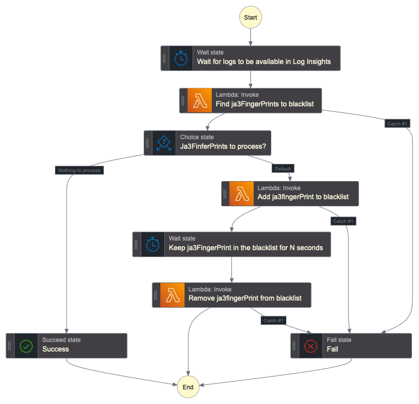

# AWS WAF Ja3FingerPrint Blacklist module

Terraform module to maintain a Ja3FingerPrint Blacklist as a WAFv2 Rule Group.

This is particularly useful when your WAF ACL contains an "expensive rule", such as Account TakeOver Prevention (ATP),
Account Creation Fraud Prevention (ACFP). 

Instead of relying solely on these rules, use the logs they generate to feed a Ja3 FingerPrint blacklist, and include 
the blacklist rule group (ARN is provided as an output of this module) as part of your WebACL, before the expensive rule. 

To do that we rely on a Step Function whose state machine is the following:



## Usage

```hcl
module "ja3fingerprint_blacklist" {
  source = "psantus/ja3fingerprint-blacklist"

  web_acl_name                = "myacl" // used to know which metric to use to trigger the StepFunction Workflow
  web_acl_metric_name         = "metric-name" // used to know which metric to use to trigger the Stepfunction workflow. Probably [for rule in aws_wafv2_web_acl.acl.rule : rule.visibility_config[0].metric_name if rule.name == "METRIC NAME YOU PUR IN YOUR TF CONFIG"][0]
  threshold_alarm             = 30 // As soon as this threshold is crossed, we'll trigger the workflow
  threshold_per_ja3           = 10 // Ja3Finder uses this to block only Ja3FingerPrints that were blocked multiple times.
  log_group_name              = "aws-waf-logs-myacl" // name of the log group which ja3Finder will query
  lambda_concurrency          = 1 // Prevents 429s fur WAFv2 APIs. See WAF quotas for limit 
  rule_group_scope            = "CLOUDFRONT"
  rule_group_maxsize          = 30 // WAF consumed capacity will be 3x that amount. 
  ja3_ban_duration_in_seconds = 3600 // How long before we unban Ja3FingerPrints
  terminating_rule_id         = "AWS-AWSManagedRulesATPRuleSet" // Name of the expensive rule we want to protect with a RuleGroup
  label_to_apply_rule_on      = "apply-ja3-filtering" // Only apply Ja3Filtering on part of the web traffic, to limit false positive blast radius.
}
```

## What this module creates

* An empty WAFv2 Rule Group
* A Cloudwatch Alarm, the state of which changes when we cross the `threshold_alarm` threshold.
* An Eventbridge rule that watches for this alarm and triggers a StepFunction workflow
* A Ja3Finder Lambda function that queries CloudWatch Logs (using Log Insights) to identify Ja3FingerPrints to ban
* A Ja3RuleGroupUpdater Lambda function that will add or remove a rule in the Rule Group
* A StepFunction workflow (see graph above) that will
  * Wait until all logs are ingested
  * Trigger the Ja3Finder Lambda function
  * Trigger the Ja3RuleGroupUpdater function to add (then, after the `ja3_ban_duration_in_seconds` delay, trigger again to remove) rules to the block list.
* All required IAM roles with least privilege.

## Deployment notes

1. If the scope is CLOUDFRONT, then your provider should be in us-east-1 region.
2. If you need to use multiple times, uses the `prefix` variable to avoid resource naming conflict

## Disclaimer

Note that the license agreement explicitely states you're responsible for the use of this module. I, in particular, 
cannot be held responsible for any cost incurred due to the use or mis-use of this module, whether those costs are 
generated directly by the resources deployed by this module, or by WAF, should the process set up by this module fail
to protect you from those costs.